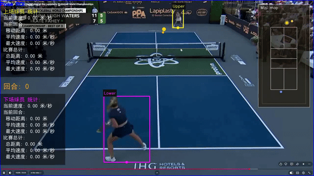
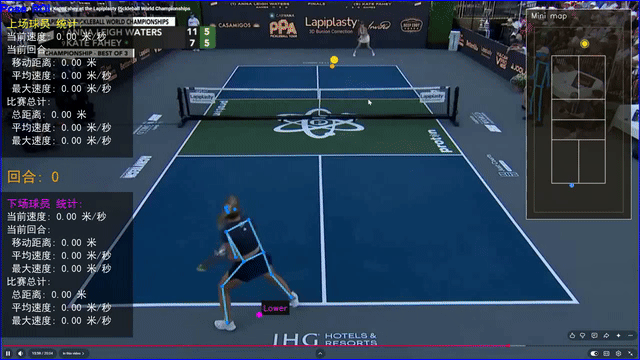
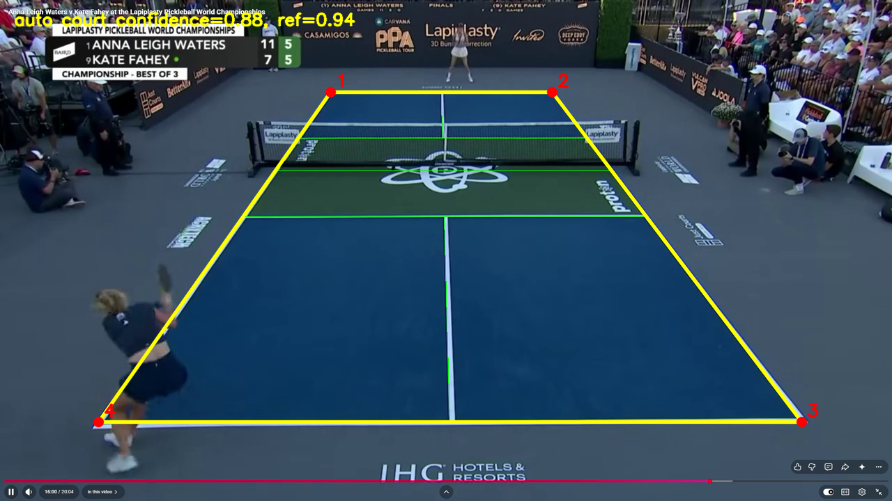
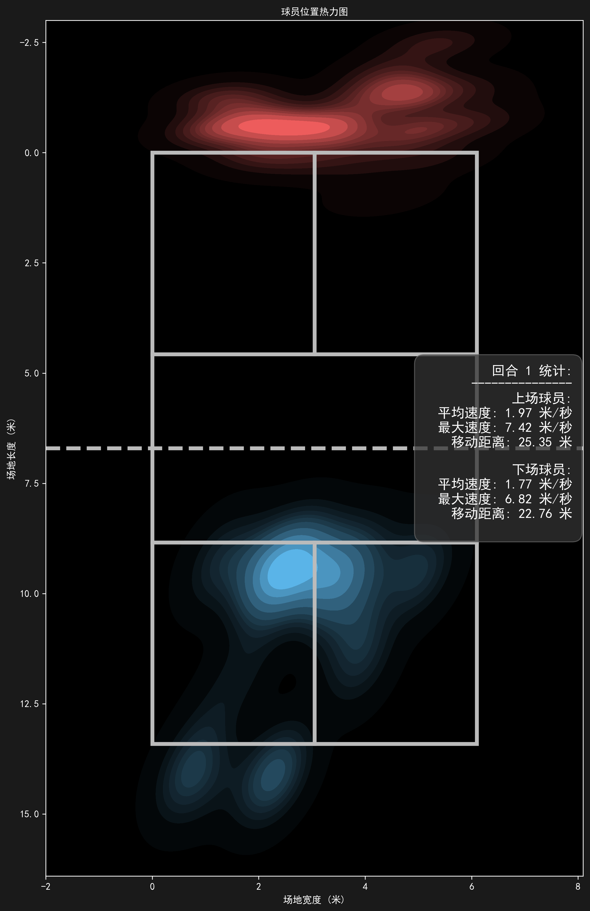
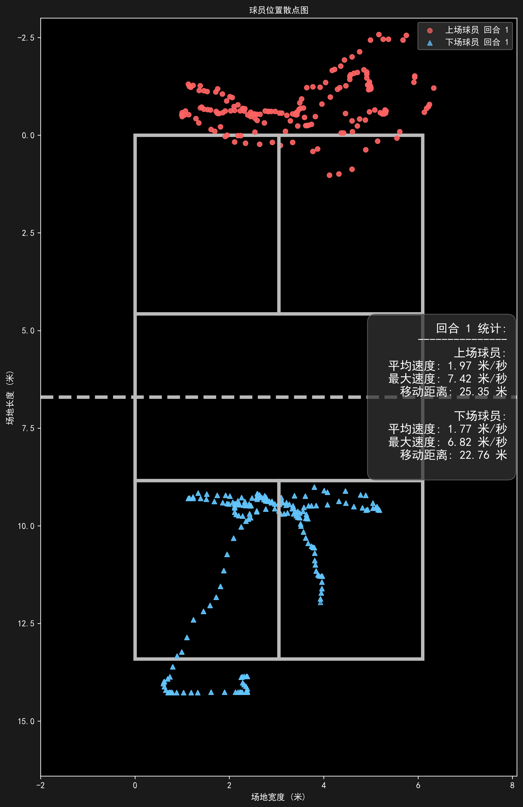

# Good-Pickleball: AI Pickleball Hawk-Eye System 🏓

## Related Projects

Good-Pickleball, Good-Tennis, and Good-Badminton are part of the same family of computer-vision sports video analysis projects. They share the same core ideas: player detection, ball trajectory tracking, court coordinate mapping, movement statistics, and visualized outputs. Each project adapts the court model, ball target, and sport-specific rules to a different sport.

| Project | Sport | Stars |
| --- | --- | --- |
| [Good-Pickleball](https://github.com/yo-WASSUP/Good-Pickleball) | Pickleball video analysis | [](https://github.com/yo-WASSUP/Good-Pickleball/stargazers) |
| [Good-Tennis](https://github.com/yo-WASSUP/Good-Tennis) | Tennis video analysis | [](https://github.com/yo-WASSUP/Good-Tennis/stargazers) |
| [Good-Badminton](https://github.com/yo-WASSUP/Good-Badminton) | Badminton video analysis | [](https://github.com/yo-WASSUP/Good-Badminton/stargazers) |

<div align="center">

[](https://github.com/yo-WASSUP/Good-Pickleball/stargazers)
[](https://github.com/yo-WASSUP/Good-Pickleball/network/members)
[](https://github.com/yo-WASSUP/Good-Pickleball/blob/main/LICENSE)

**A computer-vision video analysis tool for pickleball matches**

[中文](README.md) | [English](README_en.md)

</div>

### 🎬 Video Analysis Results

| RTMPose Pose Detection | YOLO26s Person Detection |
| --- | --- |
|  |  |

In wide pickleball match footage, players are usually small, so object detection is often more stable than pose estimation.

## 📝 Changelog

- **2026-07-01**: Migrated from Good-Tennis to the pickleball version, replaced the court model with standard pickleball dimensions, and organized the Chinese README.
- **Current version**: Supports player detection, ball detection, court coordinate mapping, trajectory statistics, rally detection, mini-map overlay, heatmaps/scatter plots, and annotated video output.
- **Experimental features**: Automatic court-corner detection, pickleball detection, and bounce-point detection are still being improved and are suitable for research and secondary development.

## 🗺️ Roadmap

- [x] Frame-by-frame pickleball match video analysis
- [x] YOLO person detection and multiple pose model options
- [x] YOLO ball detector integration
- [x] Manual/automatic pickleball court annotation and court coordinate mapping
- [x] Player movement trajectories, speed, distance, and rally statistics
- [x] Pickleball trajectory and bounce-point annotation
- [x] Standard pickleball court mini-map overlay
- [x] Chinese / English visualization text
- [x] Heatmap, scatter plot, and detection data export
- [ ] Doubles support
- [ ] More stable pickleball bounce-point detection
- [ ] A more accurate dedicated pickleball detector
- [ ] More complete hit-point and technique statistics
- [ ] Batch video analysis workflow

---

## ✨ Features

- **Player detection** - Uses YOLO person bounding-box detection by default. It can also switch to RTMPose, RTMO, or Ultralytics YOLO Pose.
- **Pickleball detection** - The default model is the `weights/tennis-ball.pt` weight copied from Good-Tennis. It has not been trained with pickleball data; it is used because a pickleball looks somewhat similar to a tennis ball, so the result will be worse than the tennis version.
- **Court annotation** - Attempts to automatically detect the four outer corners of the pickleball court by default, then falls back to manual four-corner annotation if needed.
- **Court coordinate mapping** - Maps image coordinates to a standard pickleball court coordinate system. The court is modeled as `6.096m x 13.4112m`, with the non-volley zone line `2.1336m` from the net.
- **Player position tracking** - Records player court coordinates, movement trajectories, speed, and distance.
- **Rally detection** - Automatically detects rally start/end from consecutive court-view frames and records rally IDs in the overlay and detection data.
- **Bounce-point detection** - After video processing, the full ball trajectory is cleaned, interpolated, and scored by rule-based velocity analysis. The cleaned trajectory and bounce points are displayed on the main view and mini-map.
- **Mini-map overlay** - Shows a standard pickleball court mini-map in the output video, with player, ball, and bounce-point locations.
- **Position charts** - Automatically generates player position heatmaps and scatter plots.
- **Chinese / English display** - Visualization text can be switched with `--language zh/en`.
- **Local execution** - Videos, models, and analysis outputs are all stored locally.

### 📊 Court and Position Visualization

| Automatic court detection | Player position heatmap | Player position scatter plot |
| --- | --- | --- |
|  |  |  |

## 🧩 Requirements

- Python 3.8+
- FFmpeg added to system `PATH`
- OpenCV / PyTorch / Ultralytics / RTMLib / ONNX Runtime
- NVIDIA GPU recommended; CPU can run the pipeline, but video analysis will be much slower

## ⚙️ Installation

### Windows

```bash
python -m venv .venv
.\.venv\Scripts\activate
python -m pip install --upgrade pip
pip install -r requirements.txt
```

### Linux / macOS

```bash
python -m venv .venv
source .venv/bin/activate
python -m pip install --upgrade pip
pip install -r requirements.txt
```

### GPU Acceleration (Windows / NVIDIA)

The default dependencies use CPU PyTorch and ONNX Runtime. For GPU acceleration, first confirm:

- NVIDIA GPU driver is installed and `nvidia-smi` works.
- CUDA 12.1 PyTorch wheels are recommended.
- If DLL loading fails, install or repair Microsoft Visual C++ Redistributable 2015-2022 x64.

PowerShell:

```bash
.\.venv\Scripts\activate

pip uninstall -y torch torchvision onnxruntime
pip install torch==2.5.1+cu121 torchvision==0.20.1+cu121 --index-url https://download.pytorch.org/whl/cu121
pip install onnxruntime-gpu==1.20.1
```

Verify GPU availability:

```bash
python -c "import torch; print('torch:', torch.__version__); print('cuda:', torch.cuda.is_available()); print('gpu:', torch.cuda.get_device_name(0) if torch.cuda.is_available() else 'not available')"
python -c "import onnxruntime as ort; print(ort.__version__); print(ort.get_available_providers())"
```

Expected output:

```text
cuda: True
CUDAExecutionProvider
```

Switch back to CPU dependencies:

```bash
pip install --force-reinstall -r requirements.txt
```

## 🧠 Model Preparation

Before the first run, make sure the required weight files exist in the project root `weights/` directory:

```text
weights/tennis-ball.pt      # baseline ball detector copied from Good-Tennis
weights/yolo26s.pt          # YOLO person detector
weights/yolo11s-pose.pt     # YOLO Pose model
```

If a default weight is missing, the program will report the missing file at startup. You can download baseline weights from the Good-Tennis Release page, or place your own models under `weights/` and pass them with `--ball-model`, `--person-model`, or `--yolo-pose-model`.

```text
https://github.com/yo-WASSUP/Good-Tennis/releases/latest
```

The default ball detector is still a tennis-ball detection weight. It is used to test baseline transfer and is not a dedicated pickleball model. After a dedicated pickleball detector is trained, replace `weights/tennis-ball.pt` or pass the new weight with `--ball-model`.

The player detector can be switched with `--player-detector`. The default is `yolo-person`, which uses YOLO person boxes and the bottom-center point of each box as the player position.

If local RTMPose / RTMO files are missing, `rtmlib` may attempt to download them into the user cache directory.

## 🚀 Usage

### First Run

1. Prepare the input video and the matching court template image, and make sure model weights exist under `weights/`.
2. Run the basic command:

```bash
python main.py --video-path videos/demo.mp4 --template-path templates/demo.png
```

3. The program first attempts to automatically detect the four outer corners of the pickleball court.
4. When candidate court lines are detected, a preview window is shown and `outputs/<video name>/auto_court_preview.png` is saved for inspection.
5. Press `Enter`/`Y` to accept the automatic result, or `M`/`R`/`Esc` to switch to manual four-corner annotation.
6. During manual annotation, click the four outer corners in order: top-left, top-right, bottom-right, bottom-left.
7. The annotation is saved to `outputs/<video name>/court_annotations.txt`. Future runs with the same output directory will reuse this file.
8. After analysis, check `outputs/<video name>/detect_<video name>.mp4`, `detections.jsonl`, and `position_visualizations/`.

If the video viewpoint, crop, or template image changes, delete `court_annotations.txt` in the corresponding output directory and annotate the four points again.

### Player Detection Modes

Use YOLO person-box detection by default:

```bash
python main.py --video-path videos/demo.mp4 --template-path templates/demo.png --person-model weights/yolo26s.pt
```

Enable Ultralytics multi-object tracking to reduce player-box jumps across frames:

```bash
python main.py --video-path videos/demo.mp4 --template-path templates/demo.png --person-tracker botsort
python main.py --video-path videos/demo.mp4 --template-path templates/demo.png --person-tracker bytetrack
```

The tracker `track_id` is only a weak signal for box continuity. Player identity is still assigned by `upper/lower` court half and court-coordinate continuity.

Switch to pose estimation:

```bash
python main.py --video-path videos/demo.mp4 --template-path templates/demo.png --player-detector pose --pose-family rtmpose
```

Use Ultralytics YOLO Pose:

```bash
python main.py --video-path videos/demo.mp4 --template-path templates/demo.png --player-detector pose --pose-family yolo-pose --yolo-pose-model weights/yolo11s-pose.pt
```

### Rally Detection

The program uses the court template image to identify match-view frames and maintain rally state:

- A new rally starts after several consecutive frames match the court view.
- The current rally ends after several consecutive frames do not match the court view.
- Rally IDs are written to `detections.jsonl` and shown in the output video stats overlay.
- Movement distance, speed, and other per-rally statistics are reset when a new rally starts, while full-match statistics continue accumulating.
- This logic depends on the template image and four-point court annotation; inaccurate templates can cause inaccurate rally splitting.

### Common Arguments

```text
--video-path                    Input video path, default videos/demo.mp4
--output-dir                    Output directory, default outputs/<video name>
--ball-model                    YOLO ball detector path, default weights/tennis-ball.pt
--pose-family                   Pose model family: rtmpose, rtmo, or yolo-pose
--pose-mode                     RTMPose / RTMO mode: lightweight, balanced, performance
--yolo-pose-model               YOLO pose model path or model name, default weights/yolo11s-pose.pt
--player-detector               Player detector: yolo-person or pose, default yolo-person
--person-model                  YOLO person detector path or model name, default weights/yolo26s.pt
--person-tracker                YOLO person-box tracker: none, botsort, bytetrack, default botsort
--player-detect-interval        Player detection interval in frames, default 2
--template-path                 Court template image path, default templates/demo.png
--court-detection               Court corner detection mode: manual, auto, auto-fallback, default auto-fallback
--pose-roi true|false           Show pose detection ROI box, default true
--display true|false            Show OpenCV preview window, default true
--skeletons true|false          Draw human skeletons, default true
--player-trajectories true|false Draw player trajectories, default true
--court-trajectory true|false   Draw court trajectory overlay, default true
--pickleball-trajectory true|false Draw pickleball trajectory, default true; old --tennis-ball-trajectory is still supported
--bounce-detection true|false   Detect and annotate pickleball bounce points, default true
--bounce-classifier             Optional bounce classifier pkl path; empty uses rule scoring
--mini-map true|false           Show court mini-map, default true
--player-stats true|false       Show player movement statistics, default true
--save-images                   Save processed frames
--performance-stats             Print performance timings
--visualize-positions true|false Generate heatmaps and scatter plots, default true
--audio true|false              Keep original video audio, default true
--language {zh,en}              Overlay language, default en
```

## 📦 Outputs

Default output directory: `outputs/<video name>/`

- `metadata.json`: metadata for video, models, court annotation, and output files.
- `detections.jsonl`: per-frame detection records, including rally ID, players, hands, court coordinates, speed, pickleball coordinates, and post-processed bounce events.
- `bounce_events.json`: bounce points produced from full-trajectory post-processing, including frame number, image coordinates, court coordinates, confidence, and diagnostics.
- `cleaned_ball_trajectory.json`: filtered and short-gap-interpolated ball trajectory used by the final video.
- `detect_<video name>.mp4`: output video with skeletons, trajectories, stats, mini-map, and rally ID overlay.
- `court_annotations.txt`: cached court annotation coordinates.
- `auto_court_preview.png`: automatic court detection preview, generated when an automatic candidate is available.
- `position_visualizations/heatmaps/`: player position heatmaps.
- `position_visualizations/scatter_plots/`: player position scatter plots.
- `detect_images/`: processed frame images saved when `--save-images` is enabled.

## 🗂️ Project Structure

```text
main.py                    # CLI entry and argument parsing
requirements.txt           # single dependency installation entry
pickleball_analysis/
├── system.py              # main video analysis flow: PickleballAnalysisSystem
├── analysis/              # bounce-point post-processing
├── court/                 # court annotation and coordinate mapping
├── data/                  # JSON / JSONL output
├── detection/             # pickleball detection, player detection, and pose detection
├── media/                 # video/audio processing
├── tracking/              # player, ball trajectory, and rally tracking
└── visualization/         # video overlays, statistics charts, and position plots
```

## 🙏 Acknowledgements

Good-Pickleball was migrated from Good-Tennis, and the current default ball detector also uses the Good-Tennis baseline model.

Thanks to RTMPose, RTMO, and the OpenMMLab ecosystem for pose estimation foundations, and to [Tau-J/rtmlib](https://github.com/Tau-J/rtmlib) for the lightweight pose-estimation runtime.

Thanks to [Ultralytics](https://github.com/ultralytics/ultralytics) for the YOLO object detection algorithms and tooling.

Thanks to [yastrebksv/TrackNet](https://github.com/yastrebksv/TrackNet) for organizing and publishing tennis datasets, which provide important references for this project's baseline ball detection and trajectory analysis.

## License

This project is licensed under Apache License 2.0. Third-party model weights are governed by their original licenses.
